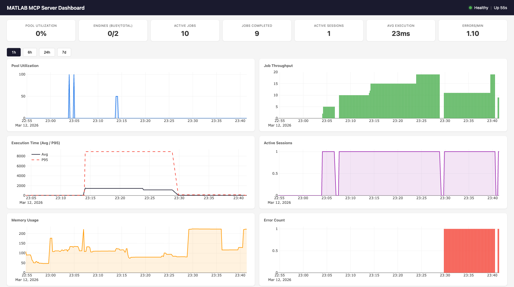
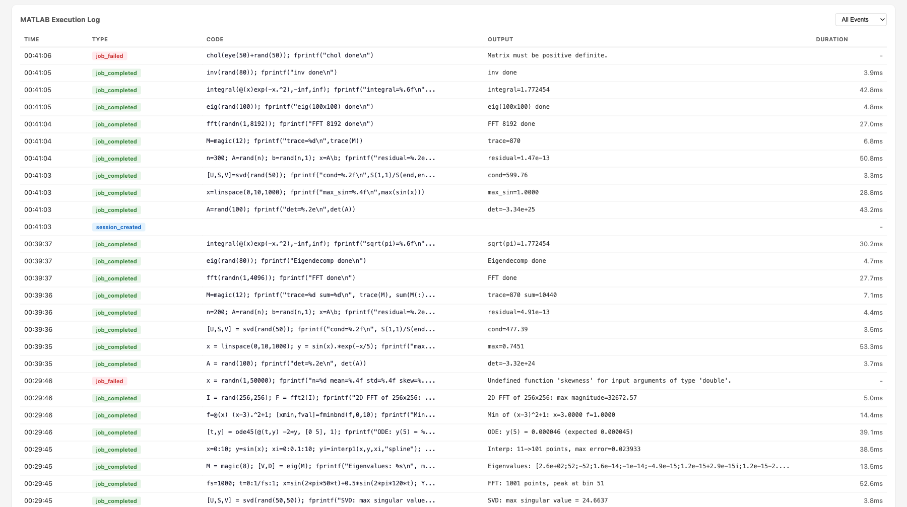

<p align="center">
  <h1 align="center">MATLAB MCP Server</h1>
  <p align="center">
    Give any AI agent the power of MATLAB — via the Model Context Protocol
  </p>
</p>

<p align="center">
  <a href="#quick-start">Quick Start</a> &bull;
  <a href="#examples">Examples</a> &bull;
  <a href="#mcp-tools-reference">Tools Reference</a> &bull;
  <a href="#configuration">Configuration</a> &bull;
  <a href="https://github.com/HanSur94/matlab-mcp-server-python/wiki">Wiki</a>
</p>

<p align="center">
  <a href="https://github.com/HanSur94/matlab-mcp-server-python/actions/workflows/ci.yml">
    
  </a>
  <a href="https://pypi.org/project/matlab-mcp-python/">
    
  </a>
  <a href="https://pypi.org/project/matlab-mcp-python/">
    
  </a>
  <a href="https://codecov.io/gh/HanSur94/matlab-mcp-server-python">
    
  </a>
  <a href="https://github.com/HanSur94/matlab-mcp-server-python/blob/master/LICENSE">
    
  </a>
</p>

---

A Python MCP server that connects **any AI agent** (Claude, Cursor, Copilot, custom agents) to a shared MATLAB installation. Execute code, discover toolboxes, check code quality, get interactive Plotly plots, and run long simulations — all through [MCP](https://modelcontextprotocol.io/).

## Why?

- Your AI agent can now **write and run MATLAB code** directly
- **Long-running jobs** (hours!) run async — the agent keeps working while MATLAB computes
- **Multiple users** share one MATLAB server via an elastic engine pool
- **Interactive plots** come back as Plotly JSON — renderable in any web UI
- **Custom MATLAB libraries** become first-class AI tools with zero code changes

## Features

| Feature | Description |
|---------|-------------|
| Execute MATLAB code | Sync for fast commands, auto-async for long jobs |
| Elastic engine pool | Scales 2-10+ engines based on demand |
| Toolbox discovery | Browse installed toolboxes, functions, help text |
| Code checker | Run `checkcode`/`mlint` before execution |
| Interactive plots | Figures auto-converted to Plotly JSON |
| Multi-user (SSE) | Session isolation with per-user workspaces |
| Custom tools | Expose your `.m` functions as MCP tools via YAML |
| Progress reporting | Long jobs report percentage back to the agent |
| Cross-platform | Windows + macOS, MATLAB 2020b+ |

## MATLAB Plot Conversion to Interactive Plotly

Every MATLAB figure is automatically converted into an interactive [Plotly](https://plotly.com/javascript/) chart — no extra code needed. When your MATLAB code creates a plot, the server:

1. **Extracts figure properties** via `mcp_extract_props.m` — axes, line data, labels, colors, markers, legends, subplots
2. **Maps MATLAB styles to Plotly** — line styles (`--` → `dash`), markers (`o` → `circle`), legend positions, axis scales, colormaps
3. **Returns interactive JSON** — renderable in any web UI with `Plotly.newPlot()`
4. **Generates a static PNG + thumbnail** as fallback for non-interactive clients

**Supported plot types:** line, scatter, bar, area, subplots (`subplot`/`tiledlayout`), multiple axes, log/linear scales

**Style fidelity:** Line styles, marker shapes, colors (RGB), line widths, font sizes, axis labels, titles, legends, grid lines, axis limits, and background colors are all preserved.

```matlab
% This MATLAB code...
x = linspace(0, 2*pi, 100);
subplot(2,1,1); plot(x, sin(x), 'r--', 'LineWidth', 2); title('Sine');
subplot(2,1,2); plot(x, cos(x), 'b-.o'); title('Cosine');
```

...returns interactive Plotly JSON with both subplots, red dashed lines, blue dash-dot with circle markers, titles, and layout — all automatically.

## Quick Start

### Prerequisites

- **Python 3.10+**
- **MATLAB 2020b+** with the [MATLAB Engine API for Python](https://www.mathworks.com/help/matlab/matlab-engine-for-python.html) installed

```bash
# Install MATLAB Engine API (from your MATLAB installation)
cd /Applications/MATLAB_R2024a.app/extern/engines/python  # macOS
# cd "C:\Program Files\MATLAB\R2024a\extern\engines\python"  # Windows
pip install .
```

### Install the server

```bash
# Option 1: Install from PyPI
pip install matlab-mcp-python

# Option 2: Install from source
git clone https://github.com/HanSur94/matlab-mcp-server-python.git
cd matlab-mcp-server-python
pip install -e ".[dev]"
```

### Run it

```bash
# Single user (stdio) — simplest setup
matlab-mcp

# Multi-user (SSE) — shared server
matlab-mcp --transport sse
```

### Connect to Claude Desktop

Add to your Claude Desktop config (`~/Library/Application Support/Claude/claude_desktop_config.json` on macOS):

```json
{
  "mcpServers": {
    "matlab": {
      "command": "matlab-mcp"
    }
  }
}
```

### Connect to Claude Code

```bash
claude mcp add matlab -- matlab-mcp
```

### Connect to Cursor

Add to `.cursor/mcp.json` in your project:

```json
{
  "mcpServers": {
    "matlab": {
      "command": "matlab-mcp"
    }
  }
}
```

### Run with Docker

```bash
# Build the image
docker build -t matlab-mcp .

# Run with your MATLAB mounted
docker run -p 8765:8765 -p 8766:8766 \
  -v /path/to/MATLAB:/opt/matlab:ro \
  -e MATLAB_MCP_POOL_MATLAB_ROOT=/opt/matlab \
  matlab-mcp

# Or use docker-compose (edit docker-compose.yml to set your MATLAB path)
docker compose up
```

> **Note:** The Docker image does not include MATLAB. You must mount your own MATLAB installation.

> **Upgrading?** If you previously installed as `matlab-mcp-server`, uninstall first: `pip uninstall matlab-mcp-server && pip install matlab-mcp-python`

## Examples

### Basic: Run MATLAB Code

Ask your AI agent:

> "Calculate the eigenvalues of a 3x3 magic square in MATLAB"

The agent calls `execute_code`:
```matlab
A = magic(3);
eigenvalues = eig(A);
disp(eigenvalues)
```

Result returned inline:
```
15.0000
 4.8990
-4.8990
```

### Signal Processing

> "Generate a 1kHz sine wave, add noise, then filter it with a low-pass Butterworth filter and plot both"

```matlab
fs = 8000;
t = 0:1/fs:0.1;
clean = sin(2*pi*1000*t);
noisy = clean + 0.5*randn(size(t));

[b, a] = butter(6, 1500/(fs/2));
filtered = filter(b, a, noisy);

subplot(2,1,1); plot(t, noisy); title('Noisy Signal');
subplot(2,1,2); plot(t, filtered); title('Filtered Signal');
```

Returns: Interactive Plotly chart + static PNG + thumbnail.

### Long-Running Simulation (Async)

> "Run a Monte Carlo simulation with 1 million trials"

```matlab
n = 1e6;
results = zeros(n, 1);
for i = 1:n
    results(i) = simulate_trial();  % your custom function
    if mod(i, 1e5) == 0
        mcp_progress(__mcp_job_id__, i/n*100, sprintf('Trial %d/%d', i, n));
    end
end
disp(mean(results));
```

The agent gets a job ID immediately, polls progress ("Trial 500000/1000000 — 50%"), and retrieves results when done.

### Custom Tools

Expose your proprietary MATLAB functions as first-class AI tools. Create `custom_tools.yaml`:

```yaml
tools:
  - name: analyze_signal
    matlab_function: mylib.analyze_signal
    description: "Analyze a signal and return frequency components, SNR, and peak detection"
    parameters:
      - name: signal_path
        type: string
        required: true
      - name: sample_rate
        type: float
        required: true
      - name: window_size
        type: int
        default: 1024
    returns: "Struct with fields: frequencies, magnitudes, snr, peaks"

  - name: train_model
    matlab_function: ml.train_classifier
    description: "Train a classification model on the given dataset"
    parameters:
      - name: dataset_path
        type: string
        required: true
      - name: model_type
        type: string
        default: "svm"
    returns: "Trained model object saved to workspace"
```

Now the agent can call `analyze_signal` or `train_model` directly — with full parameter validation and help text.

## MCP Tools Reference

### Code Execution

| Tool | Parameters | Description |
|------|-----------|-------------|
| `execute_code` | `code: str` | Run MATLAB code. Returns inline if fast (<30s), or a job ID if promoted to async |
| `check_code` | `code: str` | Run `checkcode`/`mlint`. Returns structured warnings/errors |
| `get_workspace` | — | Show variables in the current MATLAB workspace |

### Async Job Management

| Tool | Parameters | Description |
|------|-----------|-------------|
| `get_job_status` | `job_id: str` | Status + progress percentage for running jobs |
| `get_job_result` | `job_id: str` | Full result of a completed job |
| `cancel_job` | `job_id: str` | Cancel a pending or running job |
| `list_jobs` | — | List all jobs in this session |

### Discovery

| Tool | Parameters | Description |
|------|-----------|-------------|
| `list_toolboxes` | — | List installed MATLAB toolboxes |
| `list_functions` | `toolbox_name: str` | List functions in a toolbox |
| `get_help` | `function_name: str` | Get MATLAB help text for any function |

### File Management

| Tool | Parameters | Description |
|------|-----------|-------------|
| `upload_data` | `filename: str, content_base64: str` | Upload data files to the session |
| `delete_file` | `filename: str` | Delete a session file |
| `list_files` | — | List files in the session directory |

### File Reading

| Tool | Parameters | Description |
|------|-----------|-------------|
| `read_script` | `filename: str` | Read a MATLAB `.m` script file as text |
| `read_data` | `filename: str, format: str` | Read data files (`.mat`, `.csv`, `.json`, `.txt`, `.xlsx`). `format`: `summary` or `raw` |
| `read_image` | `filename: str` | Read image files (`.png`, `.jpg`, `.gif`) — renders inline in agent UIs |

### Admin

| Tool | Parameters | Description |
|------|-----------|-------------|
| `get_pool_status` | — | Engine pool stats (available/busy/max) |

### Monitoring

| Tool | Parameters | Description |
|------|-----------|-------------|
| `get_server_metrics` | — | Comprehensive server metrics (pool, jobs, sessions, system) |
| `get_server_health` | — | Health status with issue detection (healthy/degraded/unhealthy) |
| `get_error_log` | `limit: int` | Recent errors and notable events |

## Configuration

All settings live in `config.yaml` with sensible defaults. Override any setting via environment variables:

```bash
# Override pool size
export MATLAB_MCP_POOL_MIN_ENGINES=4
export MATLAB_MCP_POOL_MAX_ENGINES=16

# Override sync timeout (promote to async after 60s instead of 30s)
export MATLAB_MCP_EXECUTION_SYNC_TIMEOUT=60

# Override transport
export MATLAB_MCP_SERVER_TRANSPORT=sse
```

### Key Configuration Sections

<details>
<summary><b>Server</b> — transport, host, port, logging</summary>

```yaml
server:
  name: "matlab-mcp-server"
  transport: "stdio"        # stdio | sse
  host: "0.0.0.0"           # SSE only
  port: 8765                # SSE only
  log_level: "info"         # debug | info | warning | error
  log_file: "./logs/server.log"
  result_dir: "./results"
  drain_timeout_seconds: 300
```
</details>

<details>
<summary><b>Pool</b> — engine count, scaling, health checks</summary>

```yaml
pool:
  min_engines: 2            # always warm
  max_engines: 10           # hard ceiling
  scale_down_idle_timeout: 900   # 15 min
  engine_start_timeout: 120
  health_check_interval: 60
  proactive_warmup_threshold: 0.8
  queue_max_size: 50
  matlab_root: null         # auto-detect
```
</details>

<details>
<summary><b>Execution</b> — timeouts, workspace isolation</summary>

```yaml
execution:
  sync_timeout: 30          # seconds before async promotion
  max_execution_time: 86400 # 24h hard limit
  workspace_isolation: true
  engine_affinity: false    # pin session to engine
  temp_dir: "./temp"
  temp_cleanup_on_disconnect: true
```
</details>

<details>
<summary><b>Security</b> — function blocklist, upload limits</summary>

```yaml
security:
  blocked_functions_enabled: true
  blocked_functions:
    - "system"
    - "unix"
    - "dos"
    - "!"
    - "eval"
    - "feval"
    - "evalc"
    - "evalin"
    - "assignin"
    - "perl"
    - "python"
  max_upload_size_mb: 100
  require_proxy_auth: false
```
</details>

<details>
<summary><b>Toolboxes</b> — whitelist/blacklist exposure</summary>

```yaml
toolboxes:
  mode: "whitelist"         # whitelist | blacklist | all
  list:
    - "Signal Processing Toolbox"
    - "Optimization Toolbox"
    - "Statistics and Machine Learning Toolbox"
    - "Image Processing Toolbox"
```
</details>

<details>
<summary><b>Output</b> — Plotly, images, thumbnails</summary>

```yaml
output:
  plotly_conversion: true
  static_image_format: "png"
  static_image_dpi: 150
  thumbnail_enabled: true
  thumbnail_max_width: 400
  large_result_threshold: 10000
  max_inline_text_length: 50000
```
</details>

## Monitoring

Built-in observability with a web dashboard, JSON health/metrics endpoints, and MCP tools for AI agent self-monitoring.

### Dashboard

Access at `http://localhost:8766/dashboard` (stdio) or `http://localhost:8765/dashboard` (SSE).



Features:
- **7 live gauges**: pool utilization, engines (busy/total), active jobs, completed jobs, active sessions, avg execution time, errors/min
- **6 time-series charts** (Plotly.js): pool utilization, job throughput, execution time (avg + p95), active sessions, memory usage, error count
- **MATLAB execution log**: filterable table showing time, event type, MATLAB code, output, and duration for every job
- **Time range selector**: 1h, 6h, 24h, 7d views
- Auto-refreshes every 10 seconds



### Health Endpoint

```bash
curl http://localhost:8766/health
```

```json
{
  "status": "healthy",
  "uptime_seconds": 3600.1,
  "issues": [],
  "engines": {"total": 2, "available": 1, "busy": 1},
  "active_jobs": 1,
  "active_sessions": 3
}
```

**Status codes**: 200 for healthy/degraded, 503 for unhealthy.

**Health evaluation rules**:

| Status | Condition |
|--------|-----------|
| `unhealthy` | No engines running (`total == 0`) |
| `unhealthy` | All engines busy at max capacity (`available == 0 && total >= max_engines`) |
| `degraded` | Pool utilization > 90% |
| `degraded` | Health check failures detected |
| `degraded` | Error rate > 5/min |
| `healthy` | None of the above |

### Metrics Endpoint

```bash
curl http://localhost:8766/metrics
```

```json
{
  "timestamp": "2026-03-12T23:01:56.799Z",
  "pool": {"total": 2, "available": 1, "busy": 1, "max": 10, "utilization_pct": 50.0},
  "jobs": {"active": 1, "completed_total": 47, "failed_total": 2, "cancelled_total": 0, "avg_execution_ms": 28.5},
  "sessions": {"total_created": 5, "active": 3},
  "errors": {"total": 2, "blocked_attempts": 0, "health_check_failures": 0},
  "system": {"uptime_seconds": 3600.1, "memory_mb": 108.8, "cpu_percent": 12.3}
}
```

### Dashboard API

| Endpoint | Parameters | Description |
|----------|-----------|-------------|
| `GET /health` | — | Health status + issues |
| `GET /metrics` | — | Live metrics snapshot (no DB hit) |
| `GET /dashboard` | — | Web dashboard HTML |
| `GET /dashboard/api/current` | — | Same as `/metrics` |
| `GET /dashboard/api/history` | `metric`, `hours` | Time-series data from SQLite |
| `GET /dashboard/api/events` | `limit`, `type` | Event log with MATLAB output |

**Available history metrics**: `pool.utilization_pct`, `pool.total_engines`, `pool.busy_engines`, `jobs.completed_total`, `jobs.failed_total`, `jobs.avg_execution_ms`, `jobs.p95_execution_ms`, `sessions.active_count`, `system.memory_mb`, `system.cpu_percent`, `errors.total`

### Backend Architecture

```
                    ┌─────────────────────────────────────────────┐
                    │           MetricsCollector                   │
                    │                                             │
                    │  In-memory:                                 │
  record_event() ──│─▶ _counters (7 counters)                    │
  (sync, from any  │   _execution_times (ring buffer, maxlen=100)│
   component)      │                                             │
                    │  Background task (every 10s):               │
                    │   sample_once() ─▶ MetricsStore.insert()   │
                    │                                             │
                    │  Live snapshot (no DB):                     │
                    │   get_current_snapshot() ─▶ /metrics        │
                    └───────────┬─────────────────────────────────┘
                                │
                    ┌───────────▼─────────────────────────────────┐
                    │           MetricsStore (aiosqlite)           │
                    │                                             │
                    │  metrics table:                             │
                    │   id | timestamp | category | metric | value│
                    │   (4 indexes for fast queries)              │
                    │                                             │
                    │  events table:                              │
                    │   id | timestamp | event_type | details     │
                    │   (details = JSON with code, output, etc.)  │
                    │                                             │
                    │  Methods:                                   │
                    │   insert_metrics(), insert_event()          │
                    │   get_latest(), get_history(), get_events() │
                    │   get_aggregates(), prune()                 │
                    │                                             │
                    │  SQLite WAL mode, log-and-swallow errors    │
                    └───────────┬─────────────────────────────────┘
                                │
                    ┌───────────▼─────────────────────────────────┐
                    │     Starlette Dashboard App                  │
                    │                                             │
                    │  /health ─▶ evaluate_health(collector)      │
                    │  /metrics ─▶ collector.get_current_snapshot()│
                    │  /dashboard ─▶ cached index.html            │
                    │  /dashboard/api/* ─▶ store queries          │
                    │  /dashboard/static/* ─▶ JS, CSS, Plotly.js  │
                    └─────────────────────────────────────────────┘
```

### Event Types

Events are recorded synchronously via `collector.record_event()` from any server component. Each event includes a JSON `details` field.

| Event Type | Source | Details Fields |
|------------|--------|---------------|
| `job_completed` | Executor | `job_id`, `execution_ms`, `code`, `output` |
| `job_failed` | Executor | `job_id`, `code`, `error` |
| `session_created` | SessionManager | `session_id_short` |
| `engine_scale_up` | PoolManager | `engine_id`, `total_after` |
| `engine_scale_down` | PoolManager | `engine_id`, `total_after` |
| `engine_replaced` | PoolManager | `old_id`, `new_id` |
| `health_check_fail` | PoolManager | `engine_id`, `error` |
| `blocked_function` | SecurityValidator | `function`, `code_snippet` |

### In-Memory Counters

The collector maintains 7 counters updated on every event (no DB hit):

| Counter | Incremented By |
|---------|---------------|
| `completed_total` | `job_completed` |
| `failed_total` | `job_failed` |
| `cancelled_total` | `job_cancelled` |
| `total_created_sessions` | `session_created` |
| `error_total` | Any error event (`job_failed`, `blocked_function`, `engine_crash`, `health_check_fail`) |
| `blocked_attempts` | `blocked_function` |
| `health_check_failures` | `health_check_fail` |

### Execution Time Tracking

Job execution times are stored in a ring buffer (`deque(maxlen=100)`) for O(1) avg/p95 calculation without DB queries. The p95 is computed as `sorted_times[int((len-1) * 0.95)]`.

### Transport Integration

| Transport | Monitoring Port | How |
|-----------|----------------|-----|
| **SSE** | Same as SSE port (8765) | Dashboard mounted as Starlette sub-app via `mcp._additional_http_routes` |
| **stdio** | Separate port (8766) | Uvicorn started as background `asyncio.Task` |

### Data Retention

The cleanup loop runs every 60 seconds and calls `store.prune(retention_days=7)` to delete metrics and events older than the configured retention period. SQLite WAL mode ensures reads aren't blocked during writes.

### Configuration

```yaml
monitoring:
  enabled: true
  sample_interval: 10      # seconds between metric samples
  retention_days: 7         # days to keep historical data
  db_path: "./monitoring/metrics.db"
  dashboard_enabled: true
  http_port: 8766           # dashboard/health port (stdio only)
```

Environment overrides: `MATLAB_MCP_MONITORING_ENABLED`, `MATLAB_MCP_MONITORING_SAMPLE_INTERVAL`, etc.

## Architecture

```
AI Agent (Claude, Cursor, etc.)
       │
       │ MCP Protocol (stdio or SSE)
       ▼
┌──────────────────────────────────────────────────────────┐
│   MCP Server (FastMCP 2.x)                                │
│   20 tools + custom tools                                 │
│   Session manager  │  Security validator  │  Formatter    │
└──────────┬───────────────────────────────┬───────────────┘
           │                               │
┌──────────▼──────────────────┐  ┌─────────▼──────────────┐
│   Job Executor               │  │  MetricsCollector       │
│   Sync/async execution       │  │  In-memory counters     │
│   Timeout auto-promotion     │  │  Ring buffer (p95)      │
│   stdout/stderr capture      │  │  Background sampling    │
│   Event recording ──────────────▶  Event recording       │
└──────────┬──────────────────┘  └─────────┬──────────────┘
           │                               │
┌──────────▼──────────────────┐  ┌─────────▼──────────────┐
│   MATLAB Pool Manager        │  │  MetricsStore (SQLite)  │
│   Elastic engine pool        │  │  Time-series metrics    │
│   Scale up/down on demand    │  │  Event log with output  │
│   Health checks & replace    │  │  Aggregates & history   │
└──────────┬──────────────────┘  └─────────┬──────────────┘
           │                               │
┌──────────▼──────────────────┐  ┌─────────▼──────────────┐
│   MATLAB Engines (2020b+)    │  │  Dashboard (Starlette)  │
│   Engine 1 │ Engine 2 │ ... │  │  /health  /metrics      │
│   Workspace isolation        │  │  /dashboard (Plotly.js) │
└──────────────────────────────┘  └─────────────────────────┘
```

### Request Flow

1. AI agent sends `execute_code` via MCP protocol
2. `SecurityValidator` checks code against function blocklist
3. `JobExecutor` creates a job, acquires an engine from the pool
4. Code runs in MATLAB with stdout/stderr captured via `StringIO`
5. If completes within `sync_timeout` (30s): result returned inline
6. If exceeds timeout: promoted to async, agent gets `job_id` to poll
7. `MetricsCollector.record_event()` logs code + output + duration
8. Engine released back to pool, workspace reset

### Component Wiring

All components receive a `collector` reference at construction time. The collector is wired to live pool/tracker/sessions in the lifespan handler after startup. This allows synchronous `record_event()` calls from any component without async overhead.

```python
# Construction (before event loop)
collector = MetricsCollector(config)
pool = EnginePoolManager(config, collector=collector)
executor = JobExecutor(pool, tracker, config, collector=collector)
sessions = SessionManager(config, collector=collector)
security = SecurityValidator(config.security, collector=collector)

# Lifespan (after event loop starts)
collector.pool = pool
collector.tracker = tracker
collector.sessions = sessions
collector.store = MetricsStore(config.monitoring.db_path)
```

## Development

```bash
# Install dev dependencies
pip install -e ".[dev]"

# Run tests (no MATLAB needed — uses mock engine)
pytest tests/ -v

# Run with coverage
pytest tests/ --cov=matlab_mcp --cov-report=term-missing

# Lint
ruff check src/ tests/
```

### Project Structure

```
src/matlab_mcp/
├── server.py          # MCP server entry point, tool registration
├── config.py          # YAML config, pydantic validation, env overrides
├── pool/
│   ├── engine.py      # Single MATLAB engine wrapper
│   └── manager.py     # Elastic pool manager
├── jobs/
│   ├── models.py      # Job data model, lifecycle
│   ├── tracker.py     # Job store, pruning
│   └── executor.py    # Sync/async execution, timeout promotion
├── tools/
│   ├── core.py        # execute_code, check_code, get_workspace
│   ├── discovery.py   # list_toolboxes, list_functions, get_help
│   ├── jobs.py        # job status, result, cancel, list
│   ├── files.py       # upload, delete, list files
│   ├── admin.py       # pool status
│   ├── monitoring.py  # get_server_metrics, get_server_health, get_error_log
│   └── custom.py      # Custom tool loader from YAML
├── monitoring/
│   ├── collector.py   # Background metrics sampling, event recording
│   ├── store.py       # Async SQLite storage for time-series data
│   ├── health.py      # Health evaluation (healthy/degraded/unhealthy)
│   ├── routes.py      # HTTP route handlers (/health, /metrics)
│   ├── dashboard.py   # Starlette sub-app with dashboard API
│   └── static/        # Dashboard HTML, CSS, JS (Plotly.js)
├── output/
│   ├── formatter.py   # Result formatting
│   ├── plotly_convert.py       # Load Plotly JSON from MATLAB extraction
│   ├── plotly_style_mapper.py  # MATLAB→Plotly style/property conversion
│   └── thumbnail.py
├── session/
│   └── manager.py     # Session lifecycle, temp dirs
├── security/
│   └── validator.py   # Function blocklist, filename sanitization
└── matlab_helpers/
    ├── mcp_extract_props.m
    ├── mcp_checkcode.m
    └── mcp_progress.m
```

## Security

| Protection | Description |
|-----------|-------------|
| Function blocklist | Blocks `system()`, `unix()`, `dos()`, `!`, `eval()`, `feval()`, `evalc()`, `evalin()`, `assignin()`, `perl()`, `python()` by default |
| Filename sanitization | Rejects filenames with path traversal or invalid characters |
| Workspace isolation | `clear all; clear global; clear functions; fclose all; restoredefaultpath;` between sessions |
| SSE proxy auth | Requires reverse proxy with auth for production |
| Upload size limits | Configurable max upload size (default 100MB) |

## License

[MIT](LICENSE)

## Contributing

Contributions welcome! Please open an issue or PR on [GitHub](https://github.com/HanSur94/matlab-mcp-server-python).
